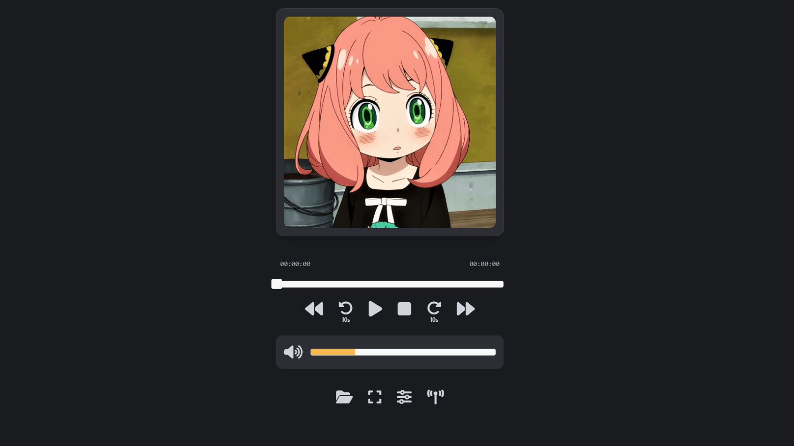
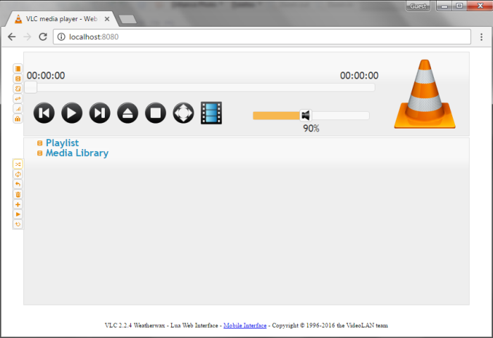
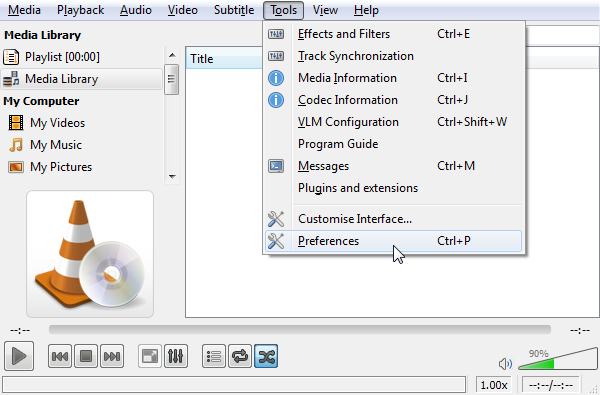
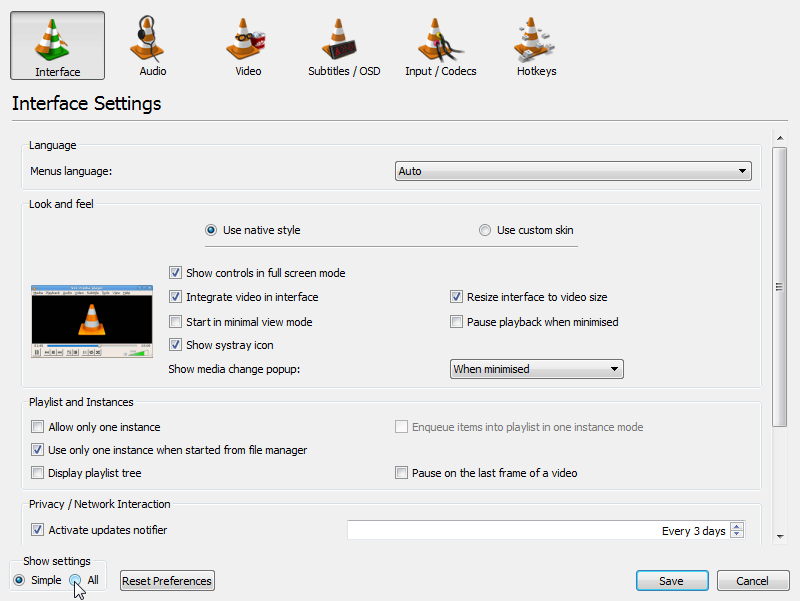
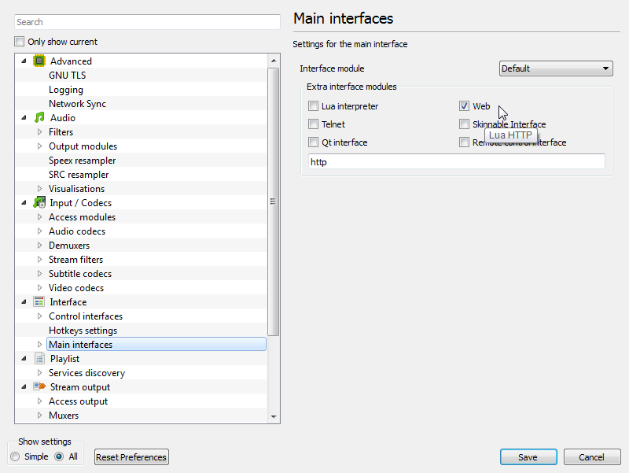
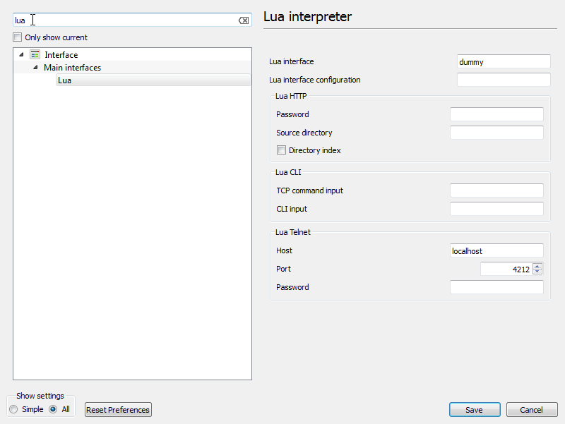
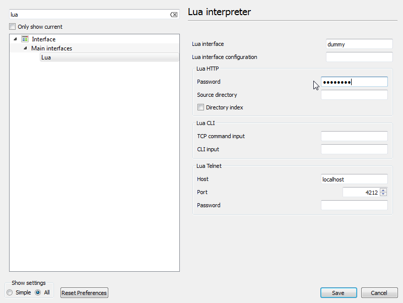
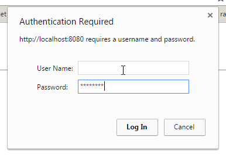

# VLC Web Remote Interface Themed

The VLC has a Web Interface that can be used to control VLC from PC and Mobile connected in same wifi Network..There is a bunch of options and interfaces in it..This repo contains html file named `mobile.html`.Its a themed version of the Original VLC mobile interface...

## Instructions for Replacing `mobile.html` in VLC

### Step 1: Navigate to the VLC HTTP Folder

**Windows:**
- Open File Explorer and navigate to:
  ```
  C:\Program Files\VideoLAN\VLC\lua\http\
  ```

**macOS:**
- Open Finder, then go to:
  ```
  /Applications/VLC.app/Contents/MacOS/share/lua/http/
  ```

**Linux:**
- Open a terminal and navigate to:
  ```
  /usr/share/vlc/lua/http/
  ```

### Step 2: Backup the Existing `mobile.html`

1. Locate the file named `mobile.html` in the folder you just navigated to.
2. Make a copy of this file and save it in a secure location (e.g., your desktop or a dedicated backup folder). This step is crucial in case you need to restore the original file later.

### Step 3: Replace `mobile.html` with the New File

1. Download the new `mobile.html` file from the specified repository (ensure that you have the correct version).
2. Once downloaded, replace the existing `mobile.html` file in the VLC HTTP folder with the new one. You may need administrative privileges to do this, especially on Windows and macOS.

### Step 4: Restart VLC

1. Close VLC if it is currently running.
2. Reopen VLC to apply the changes.

## Screenshots




> Note: The below is the Instruction to activate the VLC Web Interface...These are the taken from [azrafe7/vlc4youtube](https://github.com/azrafe7/vlc4youtube) and I didn't made this...Its a good step by step instruction so I mentioned it Here

# How to activate VLC's web interface
Did you know that VLC has a web interface? 




with it you can control the player remotely, say via a web browser, with your phone, or even from your programming language of choice.

The thing is that it's not enabled by default, but activating it is really simple.

As I said you'll need at least version 2.0 of VLC installed. Then to activate the interface follow these steps:

 **1.** open VLC

 **2.** go to `Tools->Preferences`

>   

 **3.** show `All` settings

>  

 **4.** select `Main interfaces` on the left, and tick the `Web` checkbox on the right

>  

**5.** **Done!**

To check that it is working just open a browser in the same computer running VLC and point it to [http://localhost:8080](http://localhost:8080).

You should see the web interface.


# Troubleshooting

If you get an authorization error, or are prompted for a login (as could be the case for VLC versions above 2.1), just:

 **1.** search for `lua` in VLC preferences dialog

>   

 **2.** and set a password for `Lua HTTP` there

>   

 **3.** reopen `localhost:8080` in your browser and insert the password when asked, **but remember to leave the `User Name` field blank!**

>   

VLC should be listening for incoming connections in port 8080 (restart VLC if it still doesn't work). 

> Note that VLC Web Interface will only available when VLC is running.


# References

 - [azrafe7/vlc4youtube](https://github.com/azrafe7/vlc4youtube)
 
